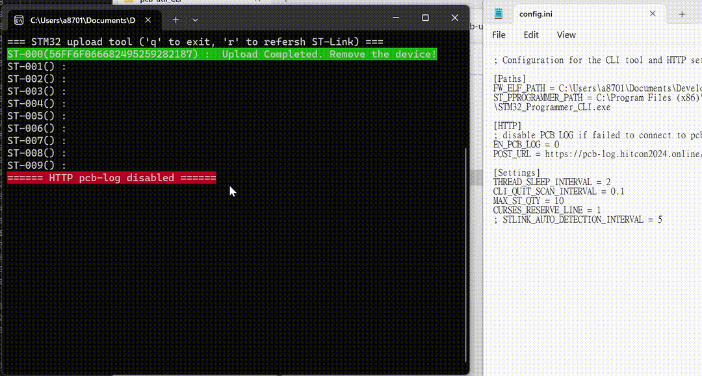

# pcb-util

pcb-util provides an utility tool for flashing FW to PCBs more effiecient in production.

# CLI Tool User Instruction
## Preparation
### Install STM32ProgrammerCLI.exe
1. Log in to MyST on STM32 website
2. Download STM32CubeProgrammer from the [link](https://www.st.com/en/development-tools/stm32cubeprog.html)
3. Unzip the en.stm32cubeprg-win32-v2-17-0.zip
4. Install the SW by double-click SetupSTM32CubeProgrammer_win32 with default configuration
5. Copy the path to STM32_Programmer_CLI. It should be something like this:
  ```
  C:\Program Files (x86)\STMicroelectronics\STM32Cube\STM32CubeProgrammer\bin\STM32_Programmer_CLI.exe
  ```

### Prepare files to flash
1. Download pcb-util_CLI.zip from Github repo.
2. Extract the folder

Here are the files that should be in pcb-util to start flashing with CLI tool

.\pcb-util_CLI
1. fw.elf
2. config.ini
3. pcb-util_CLI.exe

### Set Path to STM32ProgrammerCLI.exe
1. Put the path to ```fw.elf``` into ```[Path] FW_ELF_PATH``` in  ```config.ini``` 
2. Put the path into ```[Path] ST_PPROGRAMMER_PATH``` in  ```config.ini``` 

### Check pcb-log Server
Please check the pcb-log server is ready.

If not, disable this function by changing ```EN_PCB_LOG = 1``` in ```config.ini```


## Use pcb-util_CLI tool
1. Run:
    ```
    python pcb-util_CLI.py
    ```
2. The CLI tool will automatically detect the pcb-badge connected and flash the fwMOD.elf. Remove the pcb-badge once upload was finished
3. If you add/remove ST-Link connected to the PC, press r'to refresh the list of ST-Link 
4. press 'q' to quit the CLI tool



---
---

# For Development or Custom use

## Dev env
- Python ver
  * python 3.12
### Packages ver
- UI
  - [Streamlit](https://streamlit.io/)
      - 1.37.0
- Upload Process
  - STM32_Programmer_CLI
    -  2.17.0
-  TODO: EXE generation
   - pyinstaller
     - 24.2

## Application
The pcb-util consist of several utility scripts describing as follows
- **ReplaceELF.py (Done)**
  1. Duplicate the compiled ELF as fwMOD.elf to be modified
  2. Find & Replace the two uint8 arrays in fwMOD.elf with specific array for individual pcb-badge
  3. Printe the array around in organized HEX to verify ELF modification
- **fw_flash.py (Done)**
  - Class definition for automating the interaction with STM32_Programmer_CLI & ST-Link
- **cli_example.py (Done)**
  - An example of a multi-thread CLI app that handles each ST-Link
  - Try it out [here](#cli-tool-user-instruction)
  - Some knwown bug can be fix with some notes [here](#faq-of-cli_example)
- **pcb-util_CLI (Done)**
  - Integrate cli_examply.py and ReplaceELF.py
  - TODO: Test logging PerBoardSecret to Server
- **setting.py**
  - Some configurations for pcb-util
- **ui.py**
  - A streamlit app which spawns a web server
  - Check out [here](#try-out-ui) if your want to try it out
- **ui_example.py (Debugging)**
  - A streamlit app of a multi-thread CLI app that handles each ST-Link
  - TODO: display connected ST-link
  - TODO: auto-detect ST-Link

## Try out UI
[Streamlit](https://streamlit.io/)
to try it out:
1. Set up your Python development environment.
2. Run:
    ```
    pip install streamlit
    ```
3. Validate the installation by running official Hello app:
    ```
    streamlit hello
    ```
4. Point to directory of \hitcon-pcb-badge\pcb-util and run the UI app for HITCON
    ```
    streamlit ui.py
    ```


## FAQ of cli_example
* curses 出錯 : 

  * 因留給他的空間不夠，顯示空間拉大就好
* spyder 終端機跳掉
  * 用 vscode 執行
  
## Some notes

### ref links

* [STM32_Programmer_CLI.exe基本命令介绍](https://blog.csdn.net/yxy244/article/details/108453398)

### issue list
